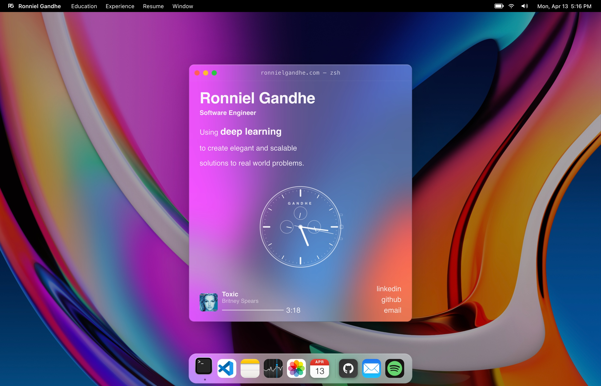

# abdullah portfolio

my portfolio site. it's gone through a few lives.

**[github](https://github.com/amsultan2010)** · **[youtube music](https://music.youtube.com/@amsultan303)**



---

## the story

this is a static personal portfolio for abdullah sultan.

the main site is a clean portfolio shell for projects, education, photos, and links. the `/desktop` route keeps the abdullahos desktop experience: boot screen, dock, menu bar, draggable windows, terminal, photos, projects, contact, and static app content.

---

## what's in here

**main site (`/`)** - clean portfolio with projects, education, photos, and links

**desktop mode (`/desktop`)** - abdullahos desktop simulation
- boot screen with startup animation
- draggable, resizable app windows
- working menu bar, dock, and system clock
- terminal-style hero with typing animation

**static content** - no live api routes or required environment variables

---

## tech

- astro 5 static output
- react 19 for interactive components
- tailwind css
- three.js + react three fiber
- framer motion
- vercel deployment
- static placeholder data

---

## run locally

```bash
git clone https://github.com/amsultan2010/abdullah-os.git
cd abdullah-os
npm install
npm run dev
```

opens at `http://localhost:4321`
